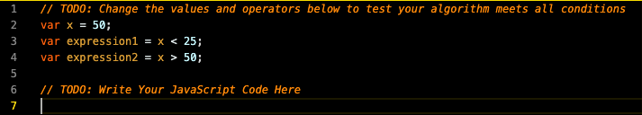
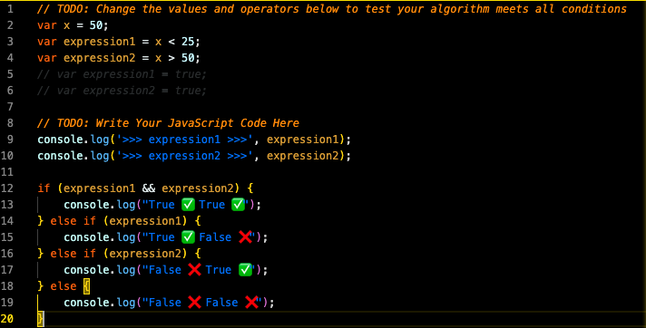

# 🏗️ Create an Algorithm Using Conditional Statements

Work with a partner to implement the following user story:

* As a developer, I want to write an algorithm that takes in two expressions and evaluates whether both expressions evaluate to `true`, only one expression evaluates to `true`, or both expressions evaluate to `false`.

## Acceptance Criteria
* It is done when the message "True ✅ True ✅" is logged when both `expression1` and `expression2` are true.
* It is done when the message "True ✅ False ❌" is logged when `expression1` is true.
* It is done when the message "False ❌ True ✅" is logged when `expression2` is true.
* It is done when the message "False ❌ False ❌" is logged when both `expression1` and `expression2` are false.

## 💡 Hints
Before you start writing your algorithm, do you have a plan documented in plain language that describes how you will use JavaScript to get it done?

## Mock Up
The following image demonstrates the unsolved function:

The following image demonstrates solved function:

## 🏆 Bonus
If you have completed this activity, work through the following challenge with your partner to further your knowledge:
* What is a switch case?
The switch statement evaluates an expression, matching the expression's value against a series of case clauses, and executes statements after the first case clause with a matching value, until a break statement is encountered. The default clause of a switch statement will be jumped to if no case matches the expression's value.
